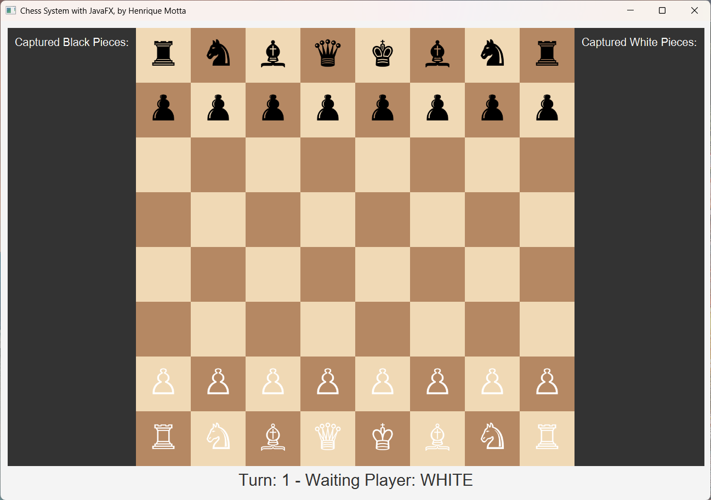

# Chess System in Java ☕♟️

**A complete chess game with a graphical interface and an AI opponent, built from the ground up in Java.**

This project is a modern desktop application developed in Java, bringing the classic game of chess to life. It evolved from a command-line application, focused on solidifying Object-Oriented Programming concepts, into a feature-rich graphical experience built with JavaFX. Users can play against another human locally or challenge a powerful AI opponent with adjustable difficulty levels, powered by the Stockfish engine.

<div align="center">

</div>

---

## ✨ Core Features

* **Complete Chess Logic:** Fully implements all standard chess rules, including piece movements, captures, check, and checkmate.
* **Special Moves:** All special moves are functional:
    * **Castling:** Kingside and Queenside.
    * **Pawn Promotion:** With player choice for the new piece.
    * ***En Passant*** **Capture.**
    * **Stalemate:** The game correctly identifies and ends in a stalemate draw.
* **Graphical User Interface (GUI):** A clean and interactive UI built with JavaFX, replacing the original command-line interface.
* **Player vs. AI Mode:** Challenge a powerful AI opponent powered by the Stockfish engine via API.
* **Adjustable AI Difficulty:** Players can choose between four difficulty levels (Easy, Medium, Hard, Professional), which adjusts the AI's calculation depth.
* **Interactive Board:**
    * Move pieces intuitively using mouse clicks.
    * Get immediate visual feedback with highlighting of all possible moves for a selected piece.
* **Real-time Game Status:** The UI displays the current turn, the active player, check status, and announces checkmate or stalemate.
* **Captured Pieces Display:** Side panels show all pieces captured by each player throughout the match.

## 🕰️ Project Timeline

-   **December 18, 2020:** Project initiated, focusing on Object-Oriented Programming principles.
-   **December 24, 2020:** [Version 1.0 (Terminal)](https://github.com/henriqueamotta/chess-system-java/tree/e13759977eb745291f076784e9fedc9ce700d711) completed. A fully functional chess game playable in the command line.
-   **August 20, 2025:** Project revival. The main goal shifted to developing a modern graphical interface and adding an AI opponent.
-   **August 24, 2025:** **Version 2.0 (GUI & AI)** completed, transforming the project into a full desktop application.

## 🛠️ Tech Stack

* **Language:** Java (JDK 21)
* **GUI Framework:** JavaFX 21
* **Chess Engine (AI):** [Stockfish Online API](https://stockfish.online/)
* **Version Control:** Git & GitHub

---

## 🚀 Getting Started

Follow these instructions to get a copy of the project up and running on your local machine.

### Prerequisites

You will need the following tools installed on your system:
* **Java Development Kit (JDK) 21 or higher:** [Adoptium Temurin](https://adoptium.net/).
* **JavaFX SDK 21 or higher:** [Gluon JavaFX](https://gluonhq.com/products/javafx/).

### Installation & Execution Guide

1.  **Clone the repository:**
    ```sh
    git clone [https://github.com/henriqueamotta/chess-system-java.git](https://github.com/henriqueamotta/chess-system-java.git)
    cd chess-system-java
    ```

2.  **Open the project in your IDE** (e.g., VS Code, IntelliJ, Eclipse).

3.  **Configure the JavaFX SDK:**
    You must configure your IDE to recognize the JavaFX libraries. The project includes configuration files (`.classpath` and `.vscode/settings.json`) that are pre-configured for an environment where the JavaFX SDK is located at `C:\Java\javafx-sdk-21.0.8`. If your path is different, you will need to update it in these files.

4.  **Run the application:**
    * Navigate to the `src/application/Main.java` class and execute it.
    * A dialog box will appear to choose the game mode (Human vs. Human or Human vs. AI).
    * If you choose to play against the AI, another dialog will prompt you to select the difficulty level.
    * Enjoy the game!

---

## ✒️ Author

* **Henrique Motta** - [GitHub](https://github.com/henriqueamotta) | [LinkedIn](https://linkedin.com/in/henriqueamotta/)

---
<br>

## 🇧🇷 Versão em Português-BR

# Sistema de Xadrez em Java ☕♟️

**Um jogo de xadrez completo com interface gráfica e oponente de IA, construído do zero em Java.**

Este projeto é uma aplicação desktop moderna desenvolvida em Java, que dá vida ao clássico jogo de xadrez. Ele evoluiu de uma aplicação de linha de comando, focada em solidificar conceitos de Programação Orientada a Objetos, para uma experiência gráfica rica em funcionalidades construída com JavaFX. Os usuários podem jogar contra outro humano localmente ou desafiar um oponente de Inteligência Artificial com níveis de dificuldade ajustáveis, potencializado pelo motor Stockfish.

<div align="center">

</div>

---

## ✨ Funcionalidades Principais

* **Lógica de Xadrez Completa:** Implementa todas as regras padrão do xadrez, incluindo movimento de peças, capturas, xeque e xeque-mate.
* **Movimentos Especiais:** Todos os movimentos especiais estão funcionais:
    * **Roque:** Pequeno e Grande.
    * **Promoção de Peão:** Com escolha da nova peça pelo jogador.
    * **Captura *En Passant***.
    * **Afogamento (Stalemate):** O jogo identifica e termina corretamente em caso de empate por afogamento.
* **Interface Gráfica (GUI):** Uma interface limpa e interativa construída com JavaFX, substituindo a interface de linha de comando original.
* **Modo de Jogo vs. IA:** Desafie um oponente de IA poderoso, utilizando o motor Stockfish através de uma API.
* **Níveis de Dificuldade da IA:** Os jogadores podem escolher entre quatro níveis de dificuldade (Fácil, Médio, Difícil, Profissional), que ajustam a profundidade de cálculo da IA.
* **Tabuleiro Interativo:**
    * Mova as peças de forma intuitiva com cliques do mouse.
    * Receba feedback visual imediato com o destaque de todos os movimentos possíveis para a peça selecionada.
* **Status do Jogo em Tempo Real:** A interface exibe o turno atual, o jogador da vez, o status de Xeque e anuncia o Xeque-Mate ou Empate.
* **Exibição de Peças Capturadas:** Painéis laterais mostram todas as peças capturadas por cada jogador durante a partida.

## 🕰️ Linha do Tempo do Projeto

-   **18 de Dezembro de 2020:** Início do projeto, com foco nos princípios de Programação Orientada a Objetos.
-   **24 de Dezembro de 2020:** [Versão 1.0 (Terminal)](https://github.com/henriqueamotta/chess-system-java/commit/ea92b067d4af2664e67a026b1544fd1c4ca63522) finalizada. Um jogo de xadrez completamente funcional, jogável pela linha de comando.
-   **20 de Agosto de 2025:** Retomada do projeto. O objetivo principal mudou para o desenvolvimento de uma interface gráfica moderna e a adição de um oponente de IA.
-   **24 de Agosto de 2025:** **Versão 2.0 (GUI & IA)** finalizada, transformando o projeto em uma aplicação desktop completa.

## 🛠️ Tecnologias Utilizadas

* **Linguagem:** Java (JDK 21)
* **Framework de GUI:** JavaFX 21
* **Motor de Xadrez (IA):** [Stockfish Online API](https://stockfish.online/)
* **Controle de Versão:** Git & GitHub

---

## 🚀 Começando

Siga estas instruções para obter uma cópia do projeto e executá-lo em sua máquina local.

### Pré-requisitos

Você precisará ter as seguintes ferramentas instaladas em seu sistema:
* **Java Development Kit (JDK) 21 ou superior:** [Adoptium Temurin](https://adoptium.net/).
* **JavaFX SDK 21 ou superior:** [Gluon JavaFX](https://gluonhq.com/products/javafx/).

### Guia de Instalação e Execução

1.  **Clone o repositório:**
    ```sh
    git clone [https://github.com/henriqueamotta/chess-system-java.git](https://github.com/henriqueamotta/chess-system-java.git)
    cd chess-system-java
    ```

2.  **Abra o projeto na sua IDE** (ex: VS Code, IntelliJ, Eclipse).

3.  **Configure o JavaFX SDK:**
    Você deve configurar sua IDE para reconhecer as bibliotecas do JavaFX. O projeto inclui arquivos de configuração (`.classpath` e `.vscode/settings.json`) pré-configurados para um ambiente onde o SDK do JavaFX está localizado em `C:\Java\javafx-sdk-21.0.8`. Se o seu caminho for diferente, você precisará atualizá-lo nesses arquivos.

4.  **Execute a aplicação:**
    * Navegue até a classe `src/application/Main.java` e execute-a.
    * Uma caixa de diálogo aparecerá para escolher o modo de jogo (Humano vs. Humano ou Humano vs. IA).
    * Se escolher jogar contra a IA, outra caixa de diálogo pedirá para selecionar o nível de dificuldade.
    * Aproveite o jogo!

---

## ✒️ Autor

* **Henrique Motta** - [GitHub](https://github.com/henriqueamotta) | [LinkedIn](https://linkedin.com/in/henriqueamotta/)

